CSEC.476.600: Reverse Malware Engineering  
Spring 2026

Professor: Mohammed Al Ani

**Final Project**

Malware Analysis Report

Group 4

Ashitha Ganesan: 409001114  
Alina Biju: 405006685  
Ahmed Abd Elaal: 764003579  
Viha Agrawal: 377004803  
Sufian Ehab Al-Hattab: 377004971

Table of Contents

Technical Summary 3

Technical Summary 3

Static Analysis 5

Metadata 5

Basic Static Analysis 5

PDF 5

Executable 10

1\. Identifying File Type 10

2\. Local anti-malware scanning 12

3\. Fingerprinting 13

4\. Online malware scanning 14

5\. Extracting Strings 16

6\. Packing 17

7\. Extracting Sections 19

8\. Extracting DLLs 20

9\. Additional Information 21

Advanced Static Analysis 23

Dynamic Analysis 26

Basic Dynamic Analysis 26

Process Explorer 27

Procmon 29

FakeNet-NG, Process Explorer and TCPView 33

Regshot 36

Wireshark 36

Process Hacker 37

Advanced Dynamic Analysis 38

Conclusion 40

References 41

# Technical Summary

The analyzed sample consists of a two-stage delivery mechanism: a weaponized PDF (Group4.pdf) concealing a 64-bit Windows PE32+ executable (Group4.exe) compressed within its internal object structure using FlateDecode. This delivery technique is designed to exploit user trust in document-based file formats while evading signature-based detection. Both local scanners (ClamAV, maldet) and the embedded PDF itself returned clean results, yet VirusTotal flagged the extracted binary with 43/72 detections, and Hybrid Analysis assigned it a maximum threat score of 100/100.

Static analysis reveals a heavily obfuscated loader architecture. The binary is a mere 7.5 KB on disk, yet its true complexity is hidden within a non-standard, high-entropy section named .djfh (entropy: 6.39–6.42), which also serves as the executable's entry point which is a deliberate subversion of normal PE structure designed to defeat static scanners that analyze only standard code sections. The legitimate .text section contains virtually no code (only 0x32 bytes), confirming that the binary functions purely as a shellcode stub. It imports a single function, VirtualProtect from KERNEL32.dll, which it uses at runtime to mark the .djfh payload region as PAGE\_EXECUTE\_READWRITE, bypassing DEP/NX hardware protections that would otherwise prevent execution from data memory.

Advanced static and dynamic analysis together reconstruct the full shellcode execution chain. Upon launch, the shellcode employs a call/pop PEB-walking technique to locate loaded modules without an import table, then resolves Windows API functions dynamically using the ROR-13 hashing algorithm which is a signature technique of Cobalt Strike and Metasploit-family payloads, confirmed by YARA rule matches against APT\_Cobalt.yar at offsets 0x1aed, 0x1d1d, and 0x1d47. The shellcode then loads wininet.dll to initialize HTTP communications and connects to the hardcoded C2 server at 212.44.1.3 on port 8084, using a spoofed Mozilla/5.0 (or Chrome 131) User-Agent string to disguise outbound traffic as legitimate browser activity. The non-standard port 8084 is a deliberate choice to evade firewall rules that filter only ports 80 and 443.

Dynamic confirmation of the C2 beaconing came from multiple tools working in concert. FakeNet-NG intercepted repeated outbound TCP connection attempts from the malware process to 212.44.1.3 on port 8084 immediately upon execution, directly corroborating the hardcoded IP and port identified during static string extraction. This was simultaneously confirmed by TCPView and Process Explorer, which showed the same connection locked in a persistent SYN\_SENT state, meaning the malware continuously retried the handshake even when the C2 server was unreachable. Critically, by acting as a simulated C2 server, FakeNet-NG enabled the malware to progress beyond the initial TCP handshake, revealing that it successfully completed a TLS 1.2 handshake, including a Server Key Exchange and Change Cipher Spec, before transitioning into an encrypted Application Data exchange. This confirms that all C2 communications are encrypted. Separately, x64dbg memory dump analysis revealed the full Base64-encoded URI path (beginning /3pojJVRF...) loaded in memory adjacent to the shellcode at runtime, confirming that the encoded request path identified during static string extraction is actively used when constructing the outbound HTTP request. Wireshark analysis on the host machine further revealed the use of **NBNS over UDP port 137** for initial connectivity probing, a deliberate choice to blend beacon traffic into routine internal Windows network activity and evade DNS-based filtering.

The malware's network behavior along with the advanced static analysis reveals a resilient stage-2 downloader: it reads incoming data in 8 KB chunks, retrying up to 10 times with 5-second intervals between failures. Upon successful download, it allocates 4 MB of executable memory, writes the next-stage payload into it, and transfers execution via a return-into-shellcode technique. This design, a minimal disk footprint stub that bootstraps a full in-memory implant, is strongly consistent with a **Cobalt Strike beacon stager** (also classified as ShellCode.Marte by Hybrid Analysis). Runtime observations via Process Hacker corroborate this: the process loads wininet.dll, iertutil.dll, IPHLPAPI.DLL, and bcrypt.dll, enabling HTTP communication, network interface enumeration for host fingerprinting, and cryptographic operations typical of an encrypted C2 channel.

Additional behaviors observed during dynamic analysis suggest deliberate operational security: the malware queries Internet Explorer registry keys (ProxyEnable, CertificateRevocation, FeatureControl) to fingerprint the network environment before beaconing; it probes DLL search-order paths in its local directory, indicating potential DLL hijacking capability; and UserAssist and AppCompatFlags registry artifacts forensically confirmed execution from the user's Downloads directory, evidence that persists even after file deletion. The C2 infrastructure was resolved to msfc1-ad2.redstone-isp.net under Redcentric Managed Solutions in the UK, suggesting use of a commercially leased server for command infrastructure. Fuzzy hash comparison via ssdeep revealed a 66% similarity with a Group 2 sample, indicating the malware likely belongs to a shared-codebase family, possibly different beacon configurations generated from the same framework.

In summary, the sample represents a sophisticated, multi-stage intrusion tool: a PDF dropper delivers a compact loader stub that evades static detection through packing, shellcode, and API hashing, then establishes an encrypted, resilient C2 channel consistent with a Cobalt Strike-style implant capable of downloading and executing arbitrary second-stage payloads entirely in memory.

# Static Analysis

This section examines the malware's properties without executing it, beginning with metadata and file identification before progressing through signature scanning, string extraction, entropy analysis, and section inspection to build a structural understanding of the sample.

### Metadata

| **Filename** | Group4.pdf |
| --- | --- |
| **Description** | PDF document, version 1.7, 0 page(s) |
| --- | --- |
| **Size** | 295.2 KiB (302,238 bytes) |
| --- | --- |
| **MD5** | 1e0e8268b96c8c95c302b36c317a667e |
| --- | --- |
| **SHA256** | f8feee5d6b3d29d4c187b5042642d4990c9541338311526d6767d10586f788b6 |
| --- | --- |

| **Filename** | Group4.exe |
| --- | --- |
| **Description** | PE32+ executable for MS Windows 4.00 (GUI), x86-64, 5 sections |
| --- | --- |
| **Size** | 7.5 KiB (7,680 bytes) |
| --- | --- |
| **MD5** | 2225079f8bab8281d7675cc62517157e |
| --- | --- |
| **SHA256** | ca5571e00a41bf4b8dacda8e2429016490c86161d8f933fb894ee43cb79a6652 |
| --- | --- |

## Basic Static Analysis

### PDF

The first thing we did was document the cryptographic hashes (MD5 and SHA256) for identification. Then we confirmed the file type using the ***xxd*** command to obtain the magic numbers. The output ‘**2550 4446**’ confirms the **PDF magic bytes**, verifying that the file header matches its extension.

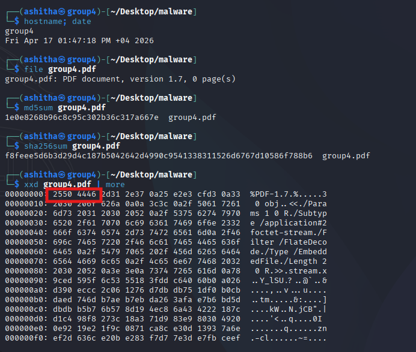

Then using the ***strings*** command we see some interesting strings such as ‘/EmbeddedFile’, ‘/Filter’ and ‘/FlateDecode’. The presence of an **embedded** file is further confirmed when we use the command ***pdfid***. The local scanning tool did not detect the file as malicious.

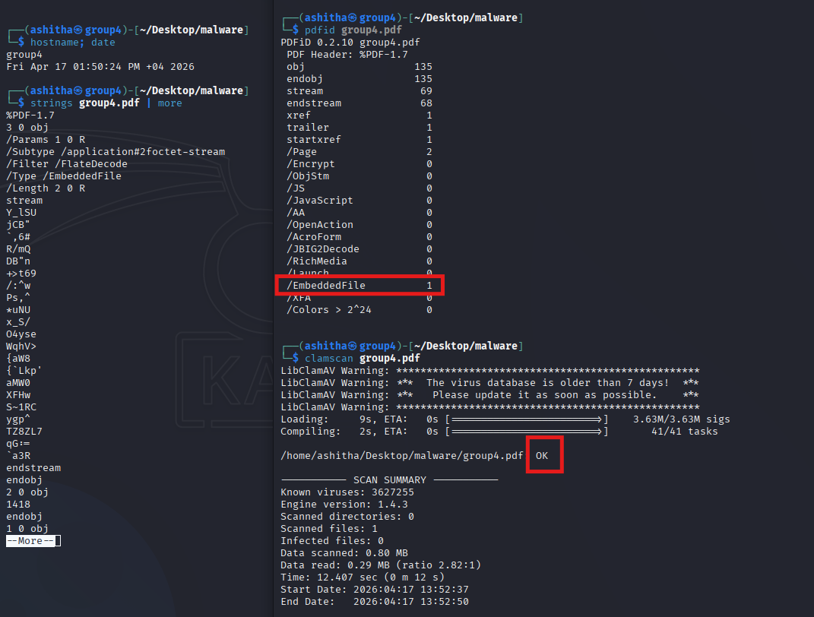

Using ***pdf-parser*** we are able to identify the location of the embedded file within Object 3.

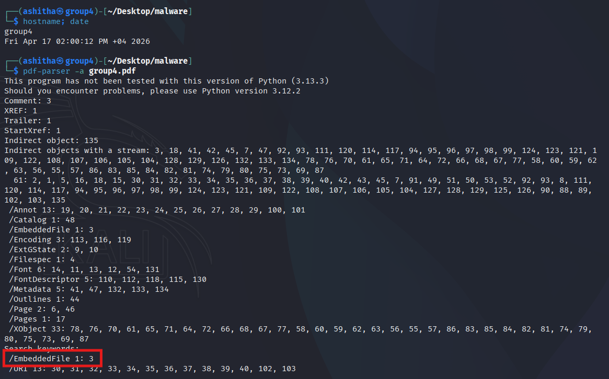

Upon further inspection of Object 3, we can see that it has ‘/Filter’ which indicates that the data in this stream isn't plain text and ‘/FlateDecode’ which indicates that the data has been **compressed**.

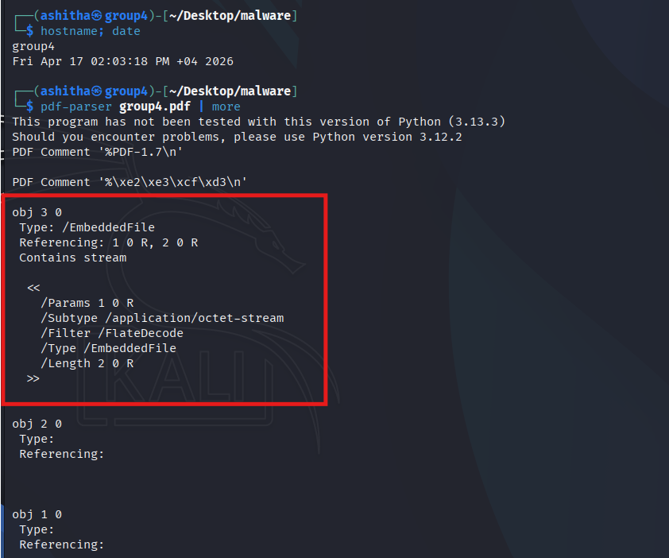

Since we have identified that Object 3 is compressed, we use the ***-f*** flag to force the tool to decompress the data in memory and display the raw content. When we do this, we can see **MZ** which is the signature for a **Portable Executable** file.

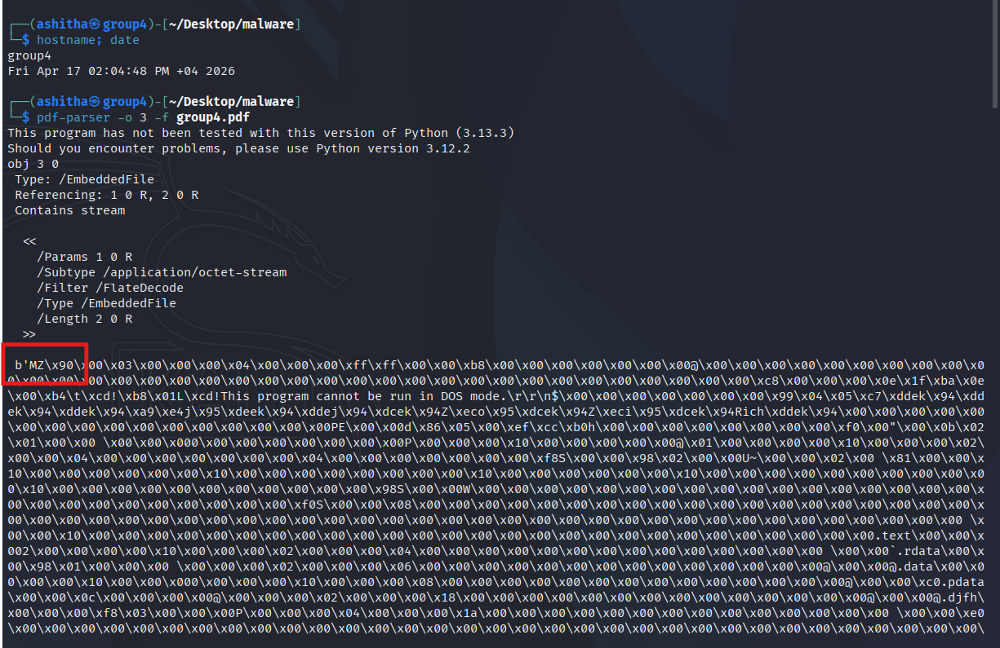

This analysis confirms that the findings are identical to the results we obtained using pdf-parser in our Linux environment. By using ***PDFStreamDumper***, we've pinpointed **Object 3** as the primary container for the payload. The presence of the **/EmbeddedFile** type and the **FlateDecode** filter indicates that the malicious executable was compressed and tucked away inside the document's structure to evade basic scanners.

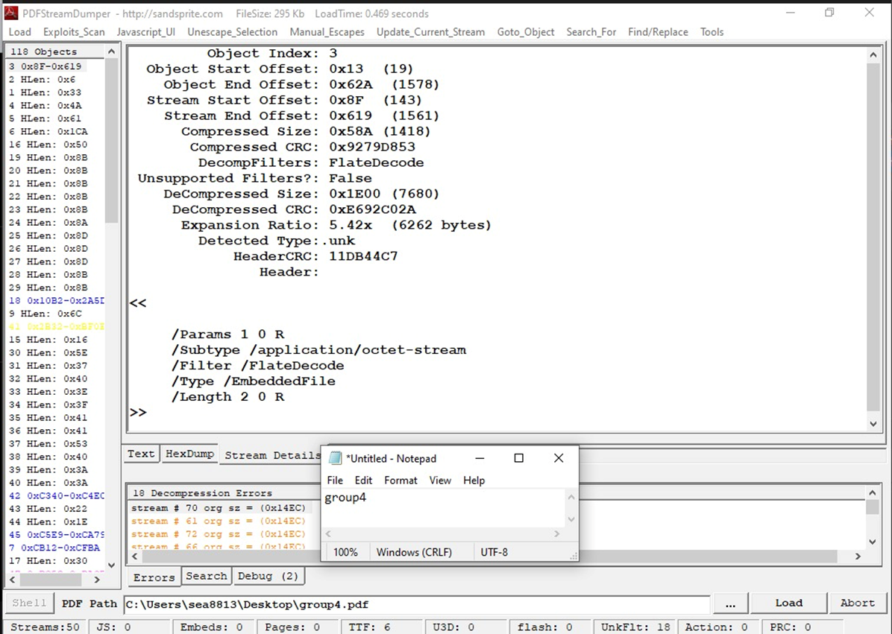

Finally, we use the ***\-d*** flag to save the decompressed payload as a standalone file named group4.exe. By dumping the content of Object 3, we have successfully isolated the hidden binary from the PDF wrapper.

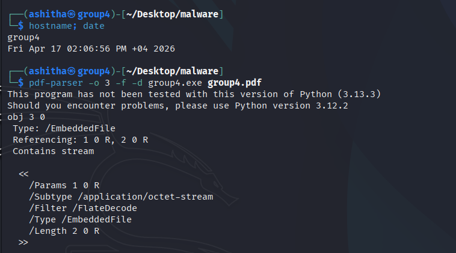

### Executable

#### Identifying File Type

After extracting the file, we ran the ***file*** command to confirm the binary's identity. This showed us that group4.exe is a **64-bit Windows PE32+ executable** designed for x86-64 architecture, containing **5 distinct sections**.

Next, we used ***xxd*** to look at the raw hex and ASCII data. We spotted the MZ magic number (**4d5a**) at the very beginning, which is the standard signature for a DOS-compatible executable. We also identified the DOS stub message. These markers confirm the file structure is intact and follows the standard **Portable Executable** format.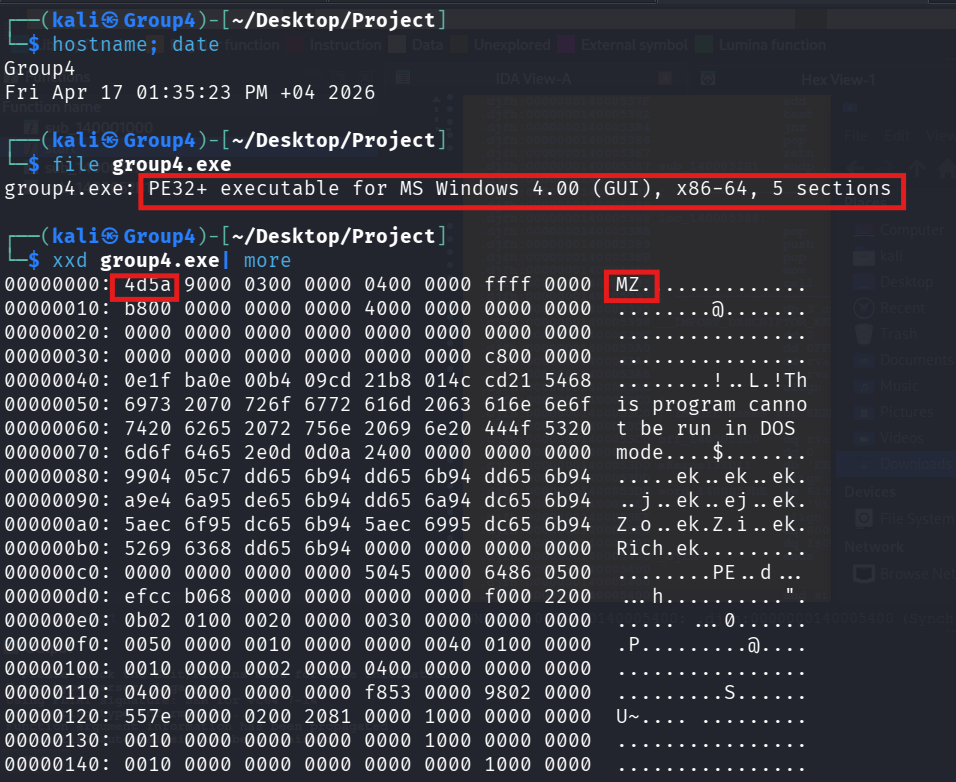

We utilized ***rabin2 -I*** to extract comprehensive binary information, which provides a more granular look at the executable's properties than our initial checks. The tool confirms that group4.exe is a **64-bit PE32+** file compiled for the **AMD 64** architecture using the C language. The output also reveals that the binary was compiled on **Friday, August 29, 2025**, and is a **Windows GUI application**.

The analysis revealed several critical memory and security properties: the baddr (Base Address) of 0x140000000 provides the necessary starting point for disassembly. Most significantly, the **nx (No-Execute) bit is enabled**, which means the system will strictly prevent any code from running within data segments. This tells us that if the file contains a hidden payload in a data section, the malware will eventually need a specific mechanism to bypass this hardware protection before it can successfully execute.

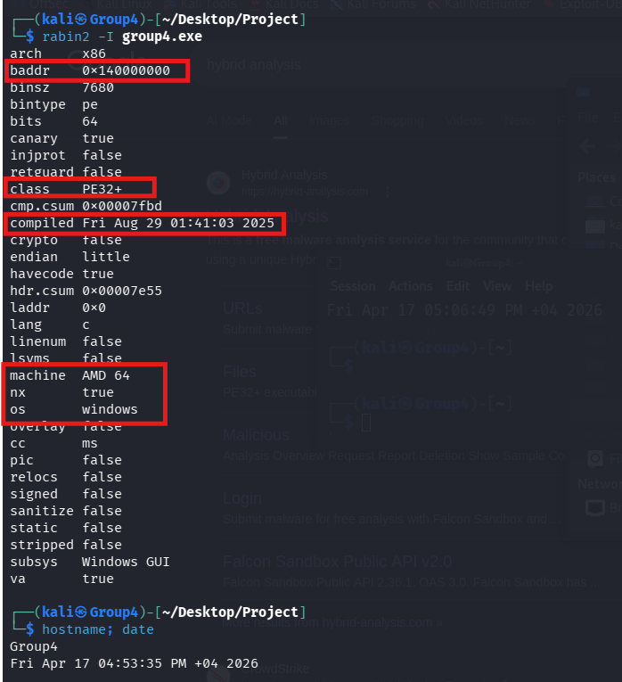

We utilized ***PEview*** within a Windows environment to perform static analysis of the file's header structure. By examining the IMAGE\_DOS\_HEADER, we confirmed the presence of the magic number **"MZ" (4D 5A)** at the very beginning of the file, which identifies it as a valid executable.

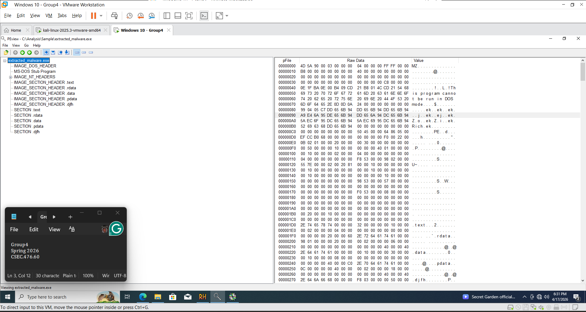

#### Local anti-malware scanning

We ran ***clamscan*** to check the file against known malware signatures, but it returned an **OK** result, indicating that no threats were detected by its engine. This happens because signature-based scanners only recognize previously identified threats; since this sample might be custom-made, zero-day, or effectively **packed to hide its malicious code**, it doesn't match anything in the current database. This result highlights why basic antivirus checks are often insufficient and confirms that we must proceed with deeper manual analysis to uncover its true behavior.

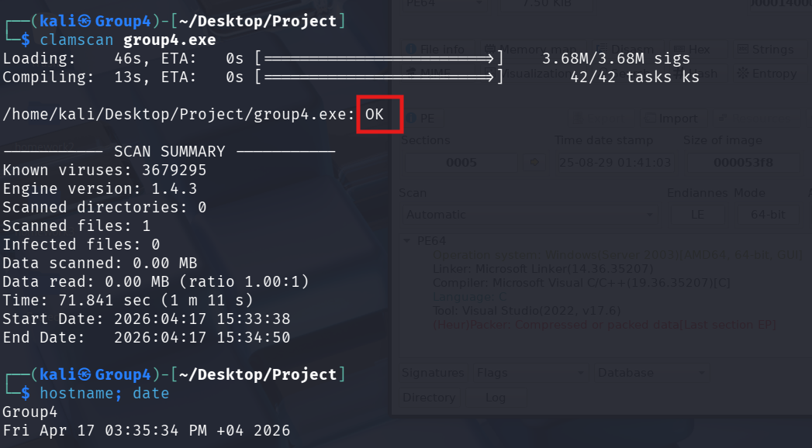

We attempted another scan using ***Linux Malware Detect (maldet)***, but as the output shows, we again received malware hits **0**. Maldet uses its own signature sets and it is also integrated with our existing ClamAV engine to perform the check. This second negative result reinforces that the file is likely a custom or obfuscated sample that isn't present in common threat databases, making it clear that automated signature-based tools won't be enough to identify its malicious nature.

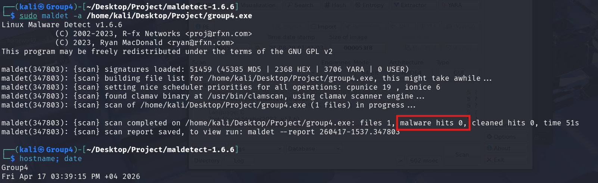

#### Fingerprinting

We then opened ***GtkHash*** to generate cryptographic fingerprints for group4.exe. By hashing the file, we created unique identifiers, specifically the **MD5** and **SHA256** values, which allow us to track the malware without relying on a filename that can easily be changed. This is a vital step for our analysis, as we can now use these hashes to check global databases like VirusTotal to see if this specific sample has been seen before or associated with known malware families

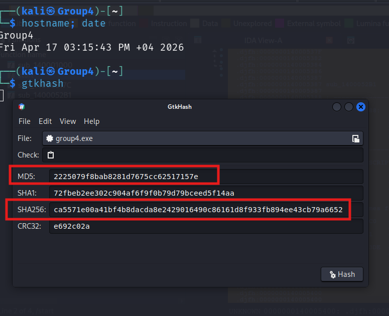

#### Online malware scanning

We uploaded the file hash to ***VirusTotal*** to check it against a global database of known threats. In stark contrast to our local scans, the results are definitive, with **43 out of 72** security vendors flagging the file as malicious. The "Code insights" section provides a detailed breakdown, identifying the sample as a malicious loader, potentially a **Cobalt Strike beacon** or similar Command and Control (C2) agent.

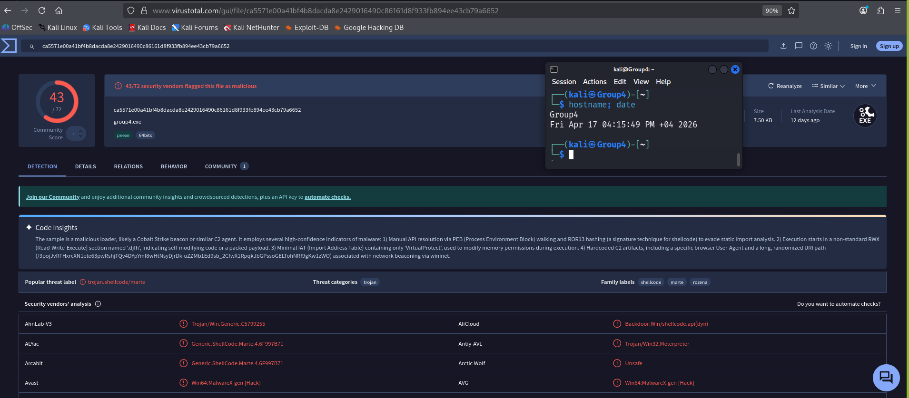

We submitted the sample to ***Hybrid Analysis*** for a comprehensive online multi-scanner review. The results were definitive, assigning the file a maximum Threat Score of 100/100 and a "**Malicious**" verdict. Industry-leading engines like CrowdStrike Falcon and MetaDefender confirmed our initial suspicions, with 78% of scanners flagging the binary. This step provided a critical global perspective, categorizing the sample specifically as **ShellCode.Marte.**

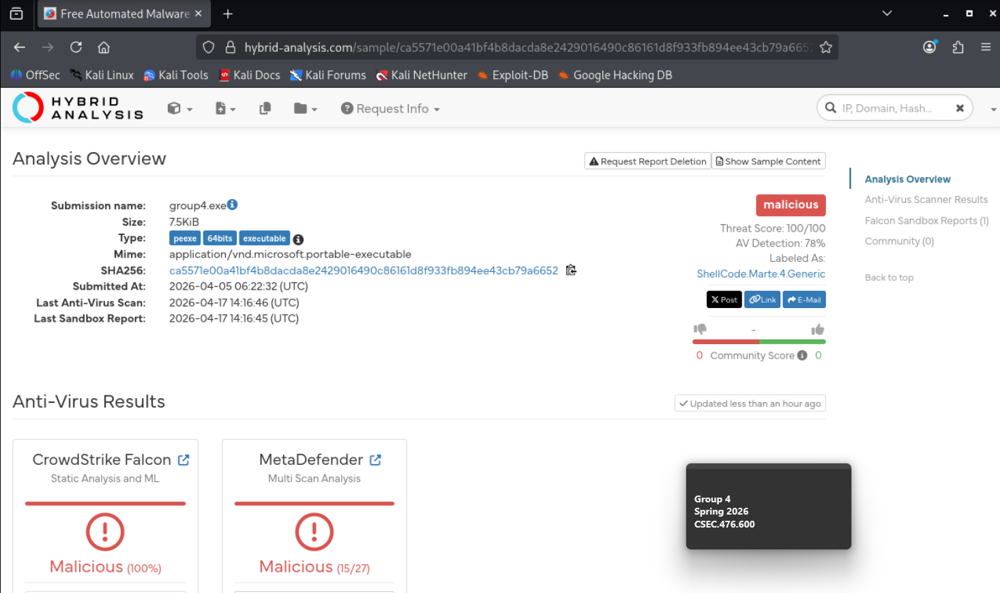

We further validated our findings by processing the sample through a ***Cuckoo Sandbox*** instance, which provided an additional automated behavioral summary. The platform assigned the file a perfect **severity score of 10 out of 10**, marking it as highly suspicious. Crucially, the **Yara rule** detection triggered a match for **Cobalt\_functions**, specifically identifying code patterns used for **ROR13** hashing and artifacts tied to Cobalt Strike beacons.

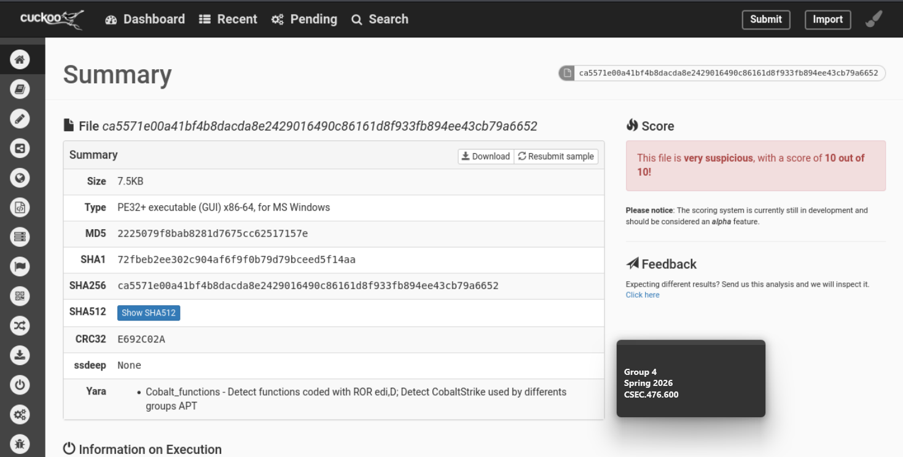

We also performed a ***Whois lookup*** on the C2 IP address 212.44.1.3 to gather intelligence on its origin and ownership. The results show that the IP is registered under the netname **REDSTONE-CUSTOMER-SERVICES** and belongs to the organization **Redcentric Managed Solutions Limited**, located in Harrogate, **United Kingdom.**

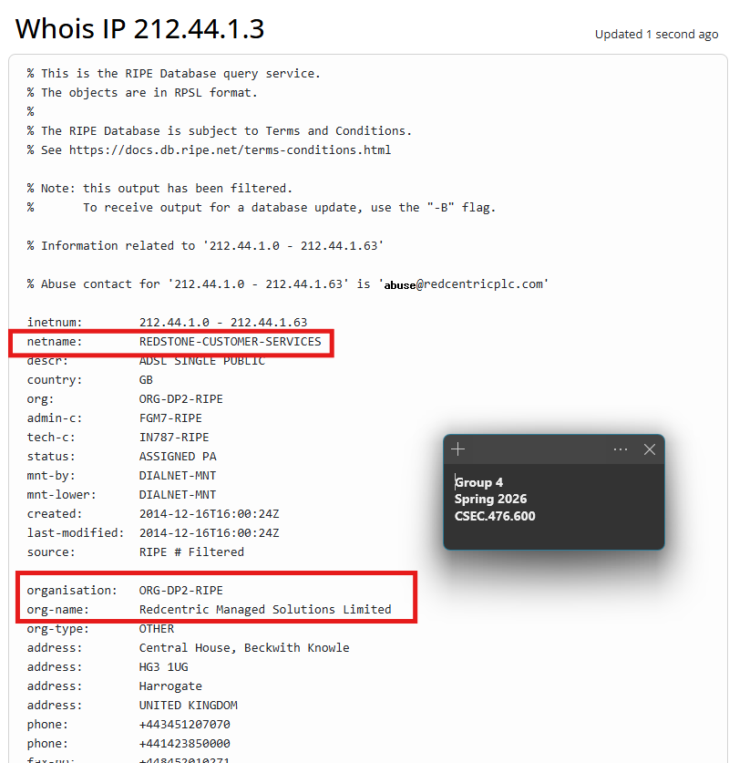

Using the ***who-dis.py*** tool, we identified the IP Block Owner as DIALNET-UK located in the United Kingdom (Country Code: GB). Geographically locating the command-and-control (C2) infrastructure provides critical context for the malware's origin and potential attribution.

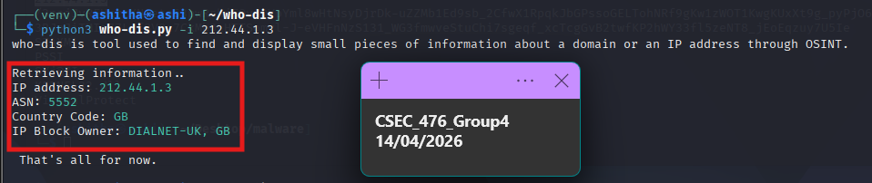

We performed a reverse DNS lookup using the ***dig -x*** command to resolve the suspicious IP address 212.44.1.3 to its associated domain name. The query successfully returned a PTR record pointing to **msfc1-ad2.redstone-isp.net.**

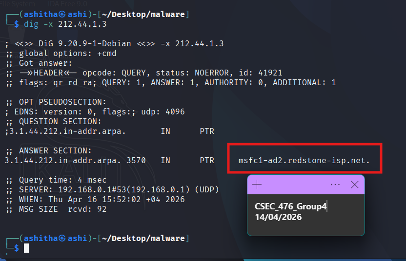

#### Extracting Strings

Moving beyond basic scanners, we used the Strings tool within a ***Detect-It-Easy*** to search for human-readable text embedded in the binary. This immediately yielded significant indicators of malicious intent, specifically identifying calls to **VirtualProtect** and **KERNEL32.dll**.This is a significant find because it reveals exactly how the malware plans to bypass the NX (No-Execute) protection we discovered earlier. We also discovered a suspicious label titled **PAYLOAD:** and a hardcoded IP address (**212.44.1.3**) paired with a long, **encoded URL path** and a **Mozilla/5.0** User-Agent string. These findings strongly suggest the malware is designed to communicate with a remote server, likely a Command and Control (C2) server, to download or execute further instructions.

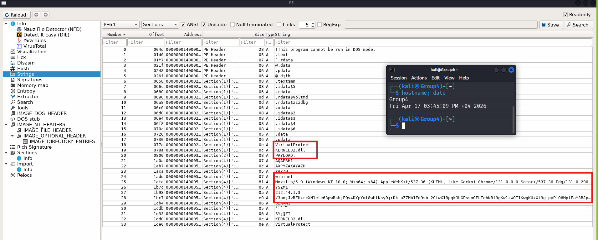

We also utilized ***FLOSS (FireEye Labs Obfuscated String Solver***), a specialized command-line tool, to extract strings that might have been hidden or obfuscated. The results from FLOSS were consistent with our previous findings from DIE (Detect It Easy), successfully identifying the Mozilla/5.0 User-Agent string and references to the WinInet library. By using FLOSS, we confirmed that these indicators are present across multiple analysis platforms, reinforcing the evidence that the malware is designed for network communication while attempting to mask its true intent from basic string scanners.

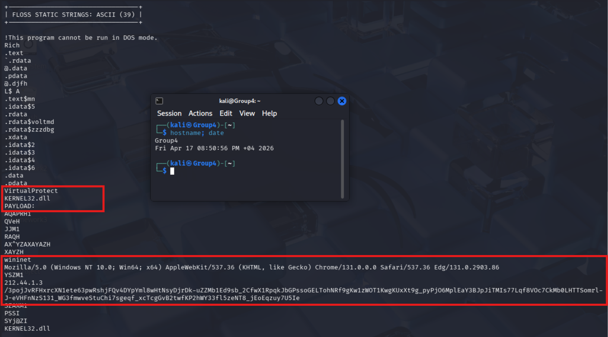

#### Packing

We then used ***Detect-It-Easy (DIE)*** to conduct a more advanced static analysis of the file's structure and compilation details. The tool confirmed that the binary was developed in C using Visual Studio 2022 and specifically identifies it as a 64-bit GUI application. Most importantly, DIE flagged the file with a heuristic warning: "**Packer: Compressed or packed data,**" noting that the **entry point (EP) is located in the last section**. This confirms our earlier suspicion that the malware is obfuscated to evade detection, explaining why the initial antivirus scans failed to identify it.

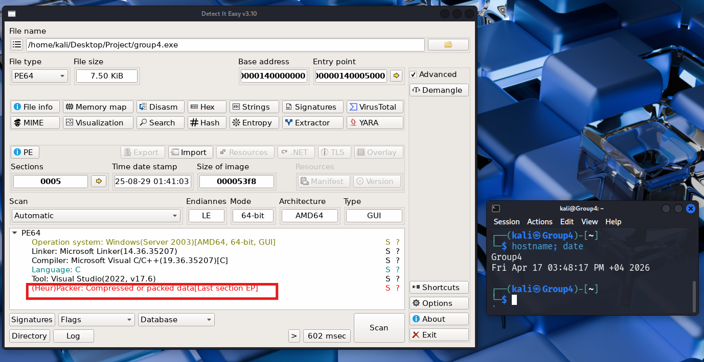

We performed an **entropy analysis** with the help of ***Detect-It-Easy (DIE)*** to measure the randomness of the data, which helps us locate hidden or encrypted payloads. Even though the tool initially labeled the overall file as "not packed," we noticed a major discrepancy when looking at the individual sections. While the standard code and data sections showed nearly zero entropy, **Section(4) \[‘.djfh’\] jumped to a high score of 6.39.**

The reason we saw the file flagged as "packed" earlier, despite these mixed entropy results, is due to the Entry Point location. In a standard executable, the program starts in the .text section where the main code lives. In this sample, the entry point is redirected to the very end of the file into that high-entropy .djfh section. This structure is a classic indicator of a "stub" or "loader", a small piece of code designed to jump to an obscured area, decrypt the actual malware into memory, and then execute it.

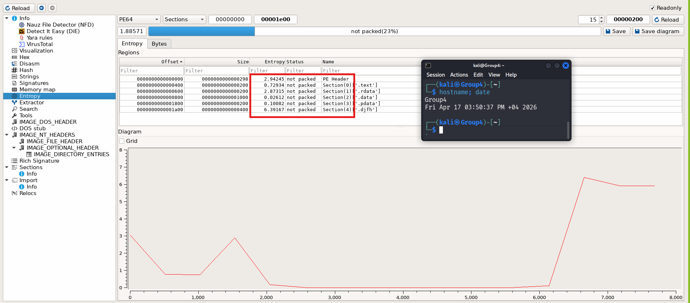

#### Extracting Sections

We examined the individual Sections of the binary on ***Detect-It-Easy (DIE)*** and found a highly non-standard layout that confirms our suspicion of packing. While we see the typical .text, .rdata, and .data sections, their VirtualSize values are extremely small, for instance, the .text section is only 0x32 bytes, which indicates that the actual program code is almost non-existent in the standard locations. Instead, we have a fifth section named **.djfh** with a much **larger relative size** and a VirtualAddress starting at 0x5000.

By looking at the **Hex data** specifically for that .djfh section, we can see exactly what is being hidden there. Unlike the empty space found in the earlier sections, this area is packed with data, including the strings we identified earlier like the **Mozilla User-Agent, the IP address (212.44.1.3), and the encoded URL path.** The fact that all these high-value indicators are consolidated into this uniquely named section, rather than being distributed normally throughout the binary, proves that .djfh is acting as the primary malicious container.

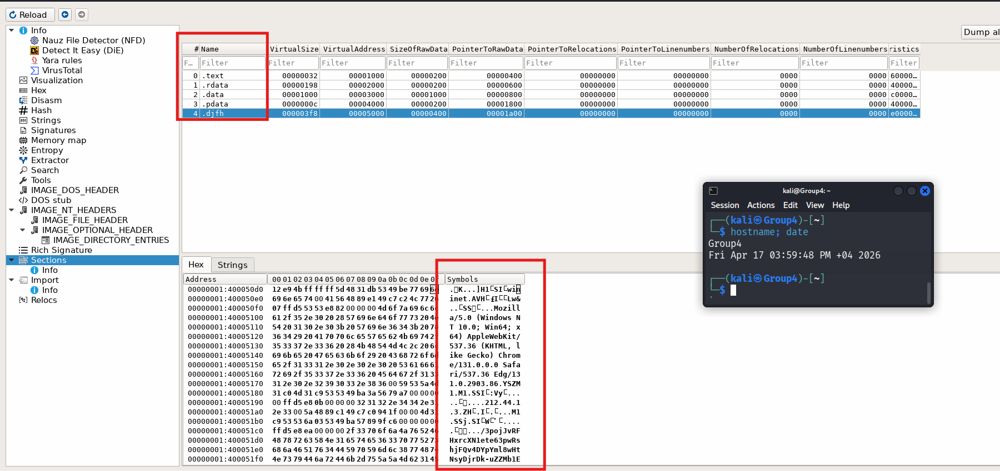

Using ***CFF Explorer***, we performed a deep inspection of the file’s section headers and raw data, which provided further evidence of the binary's suspicious nature. As highlighted in the Section Headers, the custom .djfh section is remarkably larger than the standard .text section, which contains almost no code at all. This confirms that the malware’s logic is entirely contained within this non-standard region. Most notably, the hex editor view reveals a significant string of ASCII text, specifically a User-Agent string identifying as a Mozilla/5.0 browser. This is a classic indicator of a web-based stager or a beacon, such as Cobalt Strike, which uses these strings to disguise its network traffic as legitimate web browsing during communications with a Command and Control (C2) server.

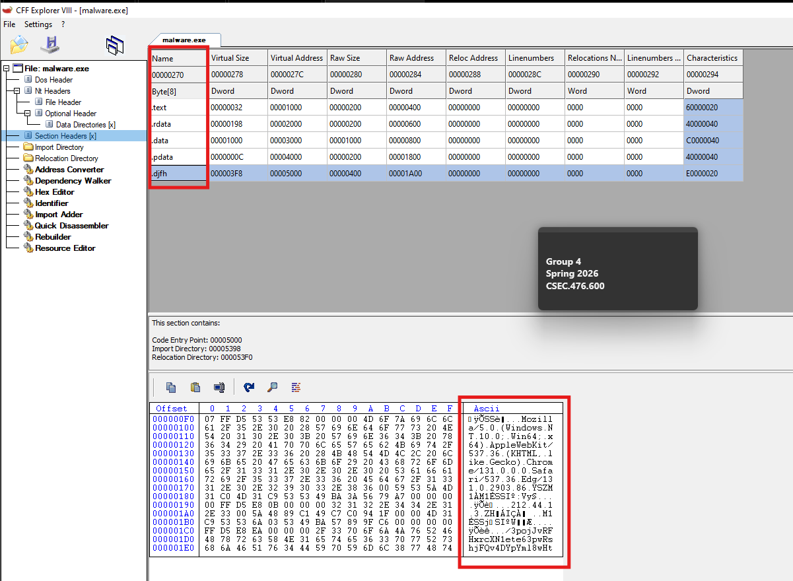

#### Extracting DLLs

We investigated the **Import Directory** on ***Detect-It-Easy (DIE)*** to see which external functions the malware requests from the Windows operating system. We found that the binary imports only a single library, **KERNEL32.dll**, and specifically calls the function **VirtualProtect**. VirtualProtect is used to change the access protection of a memory region. Given our earlier discovery of the high-entropy .djfh section, this confirms the malware's intent, it likely uses this function to make its hidden payload executable in memory, allowing it to bypass static security checks that only scan standard code sections.

### 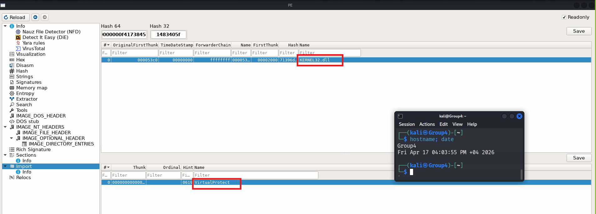

We utilized ***Dependency Walker*** to conduct a static analysis of the file's dependency hierarchy, which revealed a significantly more complex structure than the minimal Import Address Table (IAT) we saw previously. While Detect-It-Easy focuses strictly on the functions explicitly imported by the developer, Dependency Walker automatically resolves the entire dependency chain. This recursive view shows that even a "simple" import of kernel32.dll triggers a cascade of secondary and tertiary system DLLs, such as ntdll.dll and kernelbase.dll, which are required by the Windows loader to initialize the process environment. This comparison highlights the difference between a developer's intentional imports and the underlying OS requirements necessary for the binary to execute.

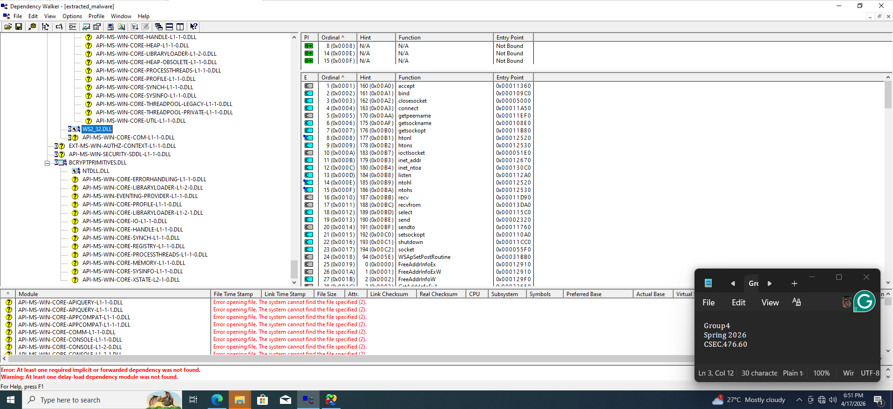

#### Additional Information

To further validate our findings through signature-based static analysis, we executed a targeted scan using ***yara rules***. We ran it against the ***malware\_index.yar rule set.*** By focusing on the extracted group4.exe binary, the scan returned a match for the **Cobalt\_functions** rule. Utilizing the ***\-s*** flag allowed for the identification of specific hex patterns at offsets **0x1d47**, **0x1aed**, and **0x1d1d,** which correspond to the functional machine code unique to a **Cobalt Strike beacon.**

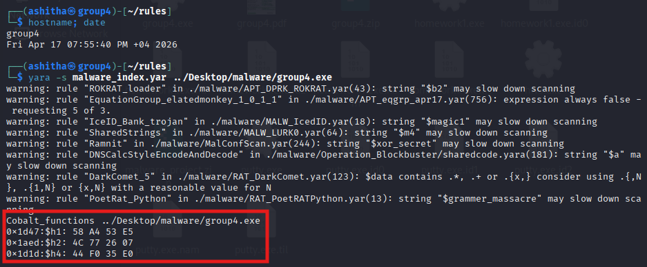

To perform a deeper validation of the ***yara*** results, we examined the source code of the ***APT\_Cobalt.yar*** rule file. This analysis reveals the specific logic used to identify the malware: the rule defines five unique hex strings ($h1 through $h5) that correspond to the **ROR13 hashed constants** for critical Windows API functions like **VirtualAllocEx, LoadLibraryEx, and Sleep.** The rule's condition, 2 of ( $h\* ), indicates a high-confidence detection threshold, requiring at least two of these functional signatures to be present.

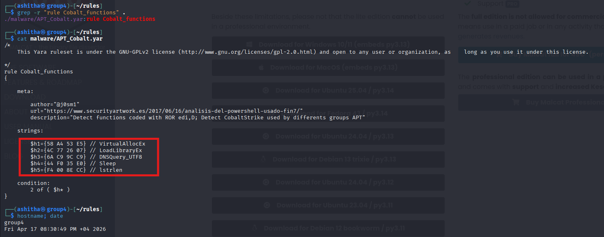

We utilized ***Protection ID*** to cross-verify the binary's security profile, identifying the DllCharacteristics flag as **0x8120**. This hex value is a bitmask representing the combined presence of High Entropy ASLR (0x0020), DEP (0x0100), and TSA (0x8000). The activation of **DEP (Data Execution Prevention)** is particularly significant, as it forces the malware to employ **memory-manipulation techniques** to execute its payload, while **TSA (Terminal Server Aware)** ensures **compatibility with multi-user environments**. Furthermore, the scan detected an **entropy of 6.42 within the .djfh section**, which matches the non-standard entry point we previously identified in Kali. This consistent finding across different tools validates that the .djfh section contains the obfuscated code or shellcode that serves as the malware's primary execution point.

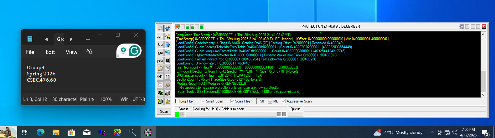

To determine the degree of similarity between the provided malware samples, a fuzzy hashing analysis was conducted using the ssdeep utility. Unlike traditional cryptographic hashes (e.g., MD5 or SHA-256) which change entirely if a single bit is altered, fuzzy hashing utilizes Context-Triggered Piecewise Hashing (CTPH) to identify sequences of bytes that are identical or nearly identical across different files.

By running ssdeep against the executables from Groups 1 through 6, we generated similarity scores that provide a quantitative measure of shared code or structure. For our own sample (group4.exe), the highest similarity was found with Group 2 (66). This indicates that the malware samples likely share a common codebase, were compiled from similar source code with minor variations, or utilized the same packing/obfuscation techniques. In a forensic context, this capability is invaluable for attribution and identifying malware families, as it allows analysts to quickly group related threats even when they have been slightly modified to evade simple signature-based detection.

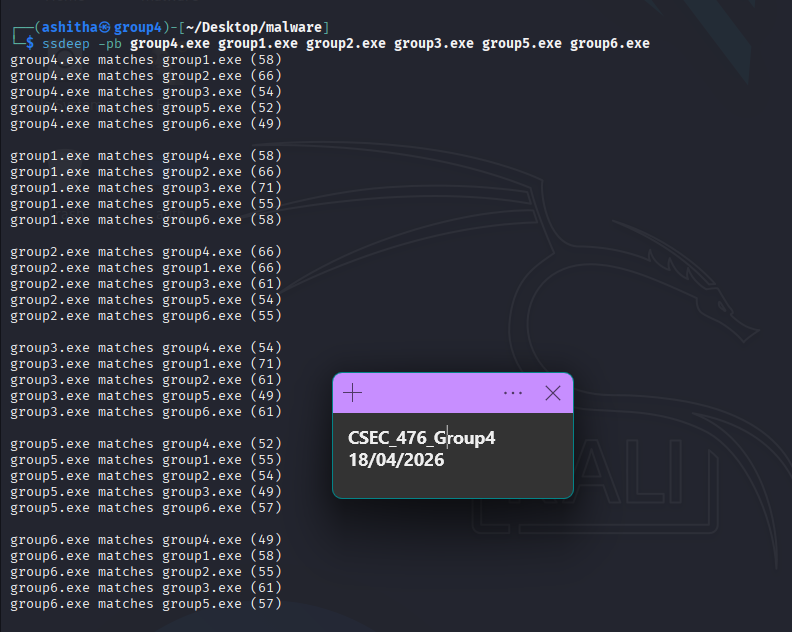

## Advanced Static Analysis

Building on the basic static findings, this section disassembles the binary to trace the shellcode's execution logic, API resolution mechanism, and network communication routines at the instruction level.

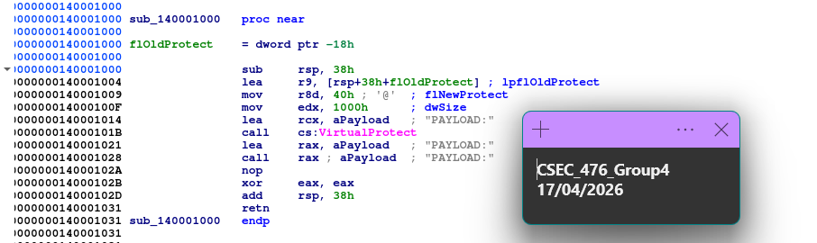

This is the entry point the PE header points to. Its sole job is to call VirtualProtect on the region labeled "PAYLOAD:" in .data with protection flags 0x40 (PAGE\_EXECUTE\_READWRITE), then immediately transfer execution there. This is a standard self-modifying code / in-memory shellcode execution technique where the payload bytes are stored as data and only become executable at runtime, which helps evade static scanners.

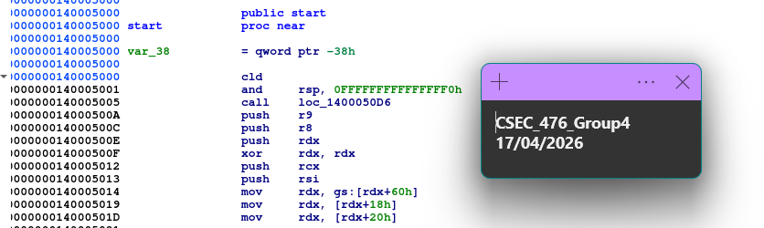

This is the classic Position-Independent Code (PIC) shellcode prologue. The call/pop trick stores the instruction pointer into rbp for later use. The gs:\[60h\] access walks the PEB → Ldr → module list. This is how shellcode finds loaded DLL base addresses (like kernel32.dll) without using the Windows API or having an import table. The hash-based API resolution follows immediately.

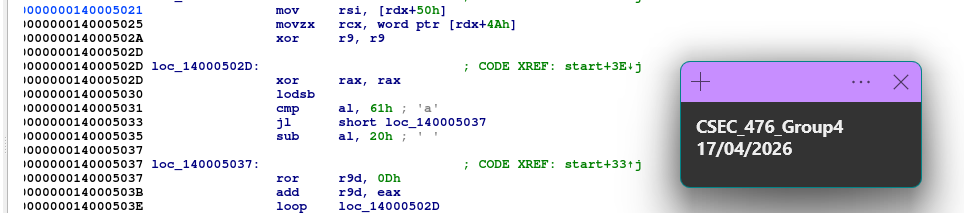

This is the **ROR-13 hashing algorithm**, the most common API resolution technique in shellcode (notably used by Metasploit payloads). It hashes each loaded DLL's name, then walks the PE export table of matching DLLs to hash each exported function name, comparing against a pre-computed target hash stored in r10. When a match is found, it resolves the actual function address and calls it via jmp rax.

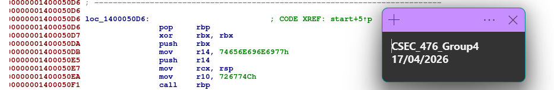

After loading the API resolver, the shellcode loads wininet.dll which is the Windows internet access library. This indicates the payload will make outbound network connections (HTTP/HTTPS). **(74656E696E6977h is "wininet" in little-endian hex)**

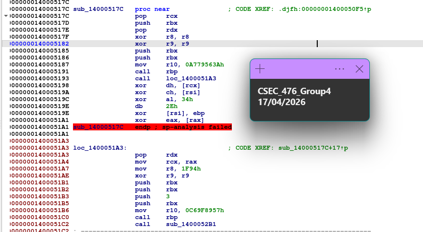

This block opens an HTTP connection. The fake Chrome user-agent string is embedded inline at 0x14000516C (g/131.0.2903.86 is the tail end). **Port 8084 (0x1F94)** is used which a non-standard port, consistent with C2 traffic avoiding port 80/443 filtering.

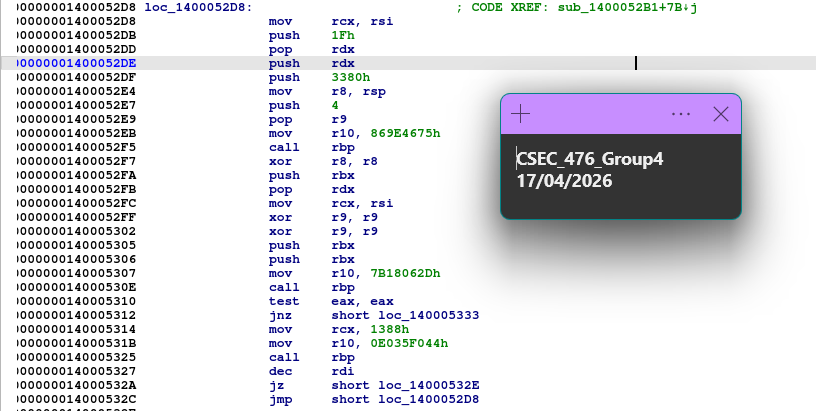

This implements a **resilient download loop**, ie: it reads downloaded data in 8KB chunks, retries up to **10 times** with a **5-second sleep** between attempts on failure. This is characteristic of a **stage-2 downloader** (e.g., Meterpreter stager) fetching a next-stage payload.

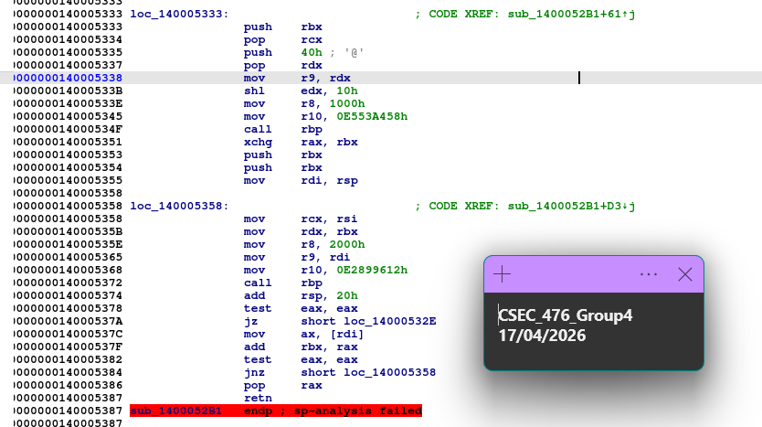

After successful download, the shellcode **allocates 4MB of executable memory**, writes the downloaded payload into it, then returns into it (using retn as an indirect jmp).

# Dynamic Analysis

This section observes the malware's live behavior in an isolated Windows environment, using process monitoring, registry tracking, network interception, and memory inspection tools to confirm and expand upon the static analysis findings. Further, it uses x64dbg to step through the malware's execution at runtime, dynamically verifying the shellcode behavior, API resolution, and C2 communication mechanics identified during static analysis.

## Basic Dynamic Analysis

We began our dynamic analysis by examining the PDF using Adobe Acrobat Reader. During manual interaction with the document, an internal comment/attachment reference named group4.exe was identified inside the PDF. This indicated that the PDF was containing an embedded executable payload.

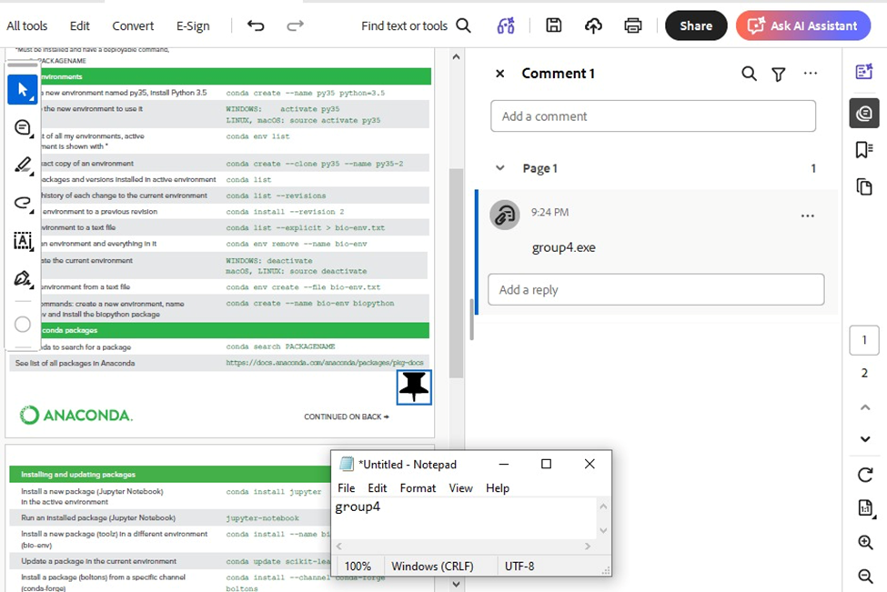

### Process Explorer

We began our dynamic analysis by looking at ***Process Explorer***. In the provided Process Explorer view, the file malware.exe (PID 6768) is visible as an **active process**. It is positioned as a **child process under explorer.exe**, indicating it was likely executed manually by a user through the Windows file manager.

The malware is currently utilizing approximately **2,084 K of Private Bytes** (dedicated memory) and has a **Working Set of 10,584 K**. The disparity between private and working set memory suggests the process has loaded several libraries (DLLs) into its address space.

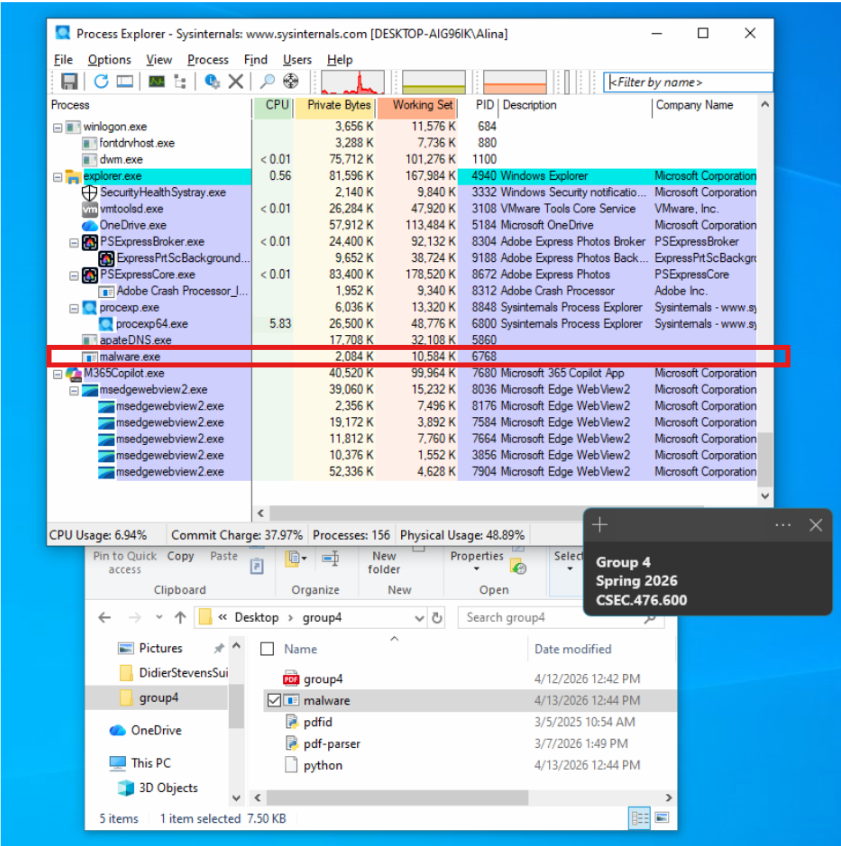

The security profile of the analyzed process, malware.exe, indicates that it is currently executing within a restricted user context. Despite being launched by a user with administrative potential, the process possesses a filtered access token, as evidenced by the explicit "Deny" flags on the BUILTIN\\Administrators and Administrators group SIDs. Furthermore, the process is operating at a Medium Integrity Level, which effectively prevents it from modifying protected system directories or high-level registry hives. The absence of advanced privileges—such as SeDebugPrivilege or SeLoadDriverPrivilege—suggests that in its current state, the malware is limited to user-land operations. Consequently, any malicious activity would likely be confined to the local user profile unless the executable successfully implements a User Account Control (UAC) bypass or a privilege escalation exploit to shed these token restrictions.

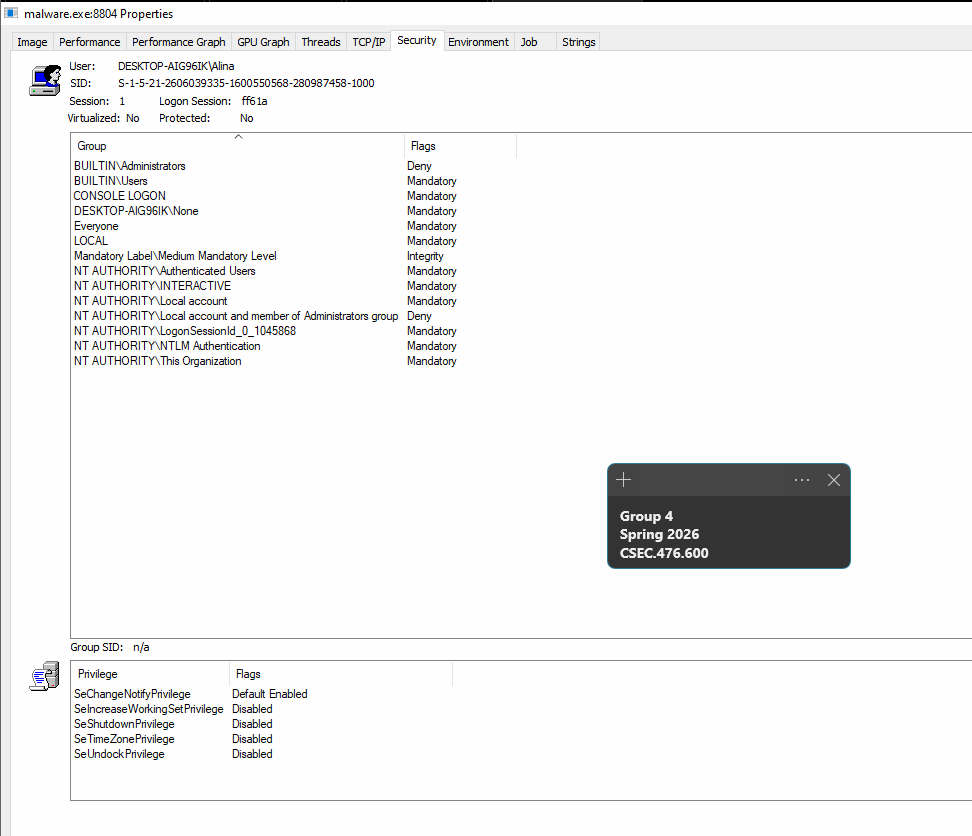

### Procmon

We continued our analysis using ***Process Monitor*** to observe the runtime behavior of the malware during execution. Procmon captures low-level system activity including process creation, file system interactions, registry operations, and network-related behavior, allowing for a detailed understanding of how the malware interacts with the operating system.

We see the initial execution of the malware process, including **Process Start**, followed by a sequence of **RegOpenKey** and **RegQueryValue** operations targeting system-level registry paths such as, **HKLM\\System\\CurrentControlSet\\Control\\Session Manager** and **AppCompatFlags**. These actions indicate that the malware is performing early-stage environment validation. By querying the Session Manager, it gathers information about system configuration, memory handling, and execution policies. Access to **AppCompatFlags** suggests the malware is checking for application compatibility settings, which are often leveraged by sandboxing or monitoring tools.

This behavior is significant because it reflects environment awareness, a common trait in malware designed to evade analysis. Before executing its main payload, the malware ensures that it is running in a suitable environment and not within a restricted or monitored setup.

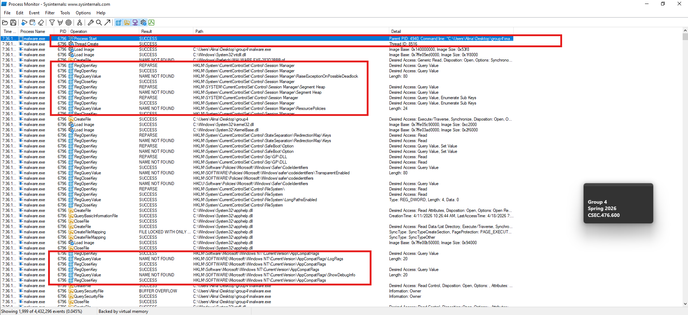

We then see the dynamic loading of multiple system libraries (Load Image operations). We applied the filter of **Operation is Load Image**. Among the loaded DLLs, several are particularly important:

wininet.dll → Enables internet communication

advapi32.dll → Provides access to registry and privilege-related APIs

sechost.dll → Handles Windows services

rpcrt4.dll → Supports remote procedure calls (RPC)

bcrypt.dll → Provides cryptographic functions

The presence of these libraries indicates that the malware is preparing to perform advanced system-level operations. Specifically, the inclusion of networking libraries (wininet.dll) confirms its capability to communicate over the internet, while cryptographic libraries suggest potential use of encryption or obfuscation techniques. It is important to note that we only see the DLLs, when the malware is run.

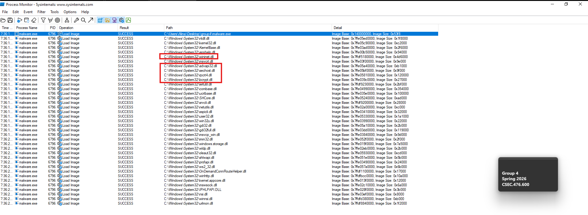

We then found something particularly interesting that captures a crucial behavior where the malware attempts to **load wininet.dll from its local directory**, resulting in a **NAME NOT FOUND** error, before successfully **loading it from C:\\Windows\\System32**. This same pattern is observed with other DLLs such as, iertutil.dll, srvcli.dll, netutils.dll, and sspicli.dll.

This behavior demonstrates the **Windows DLL search order mechanism**, where the system first checks the application’s directory before falling back to system directories. From a security perspective, this is highly significant. It suggests that the malware is either **attempting to locate malicious DLLs in its execution directory**, or designed to exploit DLL search order hijacking, where a malicious DLL placed in the same directory could be loaded instead of the legitimate one. This indicates a level of sophistication, as the malware is aware of how Windows resolves dependencies and may leverage this behavior for stealth or persistence.

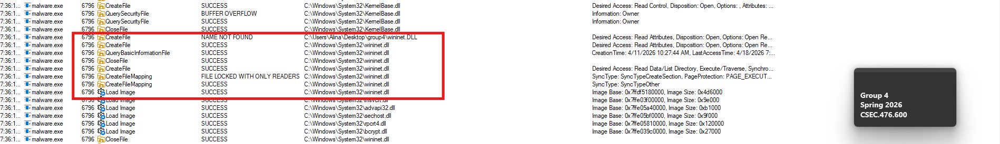

The process is systematically checking for specific values such as **ProxyEnable, EnableHttp1\_1**, **MaxConnectionsPerServer**, and **CertificateRevocation**. While many of these return NAME NOT FOUND, this behavior is typical of a process attempting to "fingerprint" the system's network configuration or browser environment.

The rapid-fire nature of the RegQueryValue operations suggests the program is scanning for proxy settings or timeout configurations, likely to ensure it can establish an outbound connection without being blocked by local network restrictions or security certificates. By looking at keys like **DisableKeepAlive** and **ReceiveTimeout**, the malware may be attempting to modify how it communicates with a Command and Control (C2) server to make the traffic appear more like standard browser behavior or to bypass certain security filters.

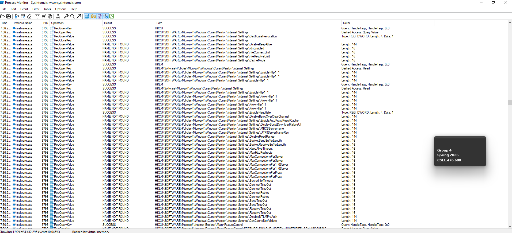

We can further extract critical forensic evidence regarding the system discovery and environment-tailoring phase of the malware's execution. By methodically querying keys within the FeatureControl subkey across both HKLM and HKCU hives, malware.exe is essentially auditing the host’s security configuration to identify active browser-level protections.

Specifically, the successful enumeration of **FEATURE\_LOCALMACHINE\_LOCKDOWN** suggests the binary is checking for permission to execute scripts with elevated privileges, while the hits on **FEATURE\_MIME\_HANDLING** indicate it is probing how the system handles file types to potentially exploit content-sniffing vulnerabilities. **FEATURE\_HTTP\_USERNAME\_PASSWORD\_DISABLE** indicates an interest in whether the system blocks credentials embedded directly in URLs, a setting the malware might exploit to automate logins or exfiltrate data via authenticated web requests. **FEATURE\_DISABLE\_UNICODE\_HANDLE\_CLOSING\_CALLBACK** suggests the malware is investigating low-level process handling and error-reporting behaviors, likely to ensure that its own file-handling or communication routines don't trigger system alerts or crash callbacks during execution.

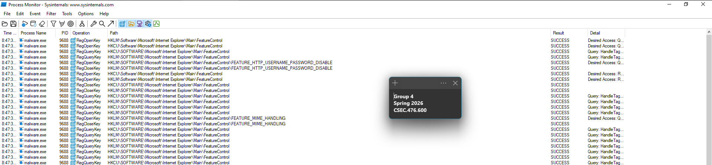

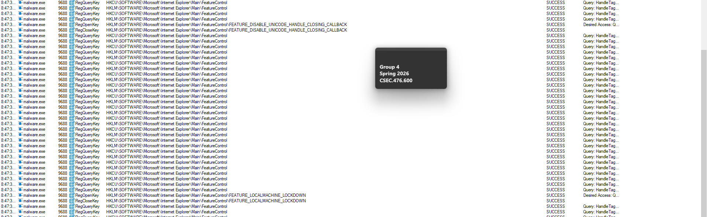

We see **multiple TCP connection attempts**, including reconnects and disconnects.Frequent reconnect attempts suggest persistence in communication, reinforcing the idea that the malware relies on **external communication** for further instructions or data exchange.

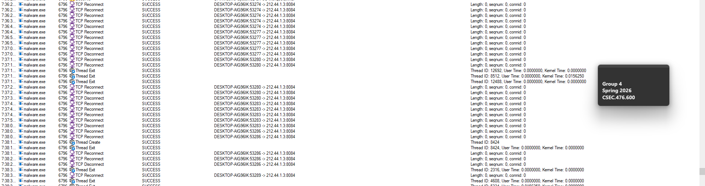

The image shows **multiple threads** being created by the malware process. Thread creation is significant because it indicates concurrent execution of tasks. Instead of operating sequentially, the malware distributes its workload across multiple threads. This design **improves efficiency and responsiveness**, and is commonly seen in more advanced malware. It also makes analysis more complex, as multiple behaviors can occur simultaneously.

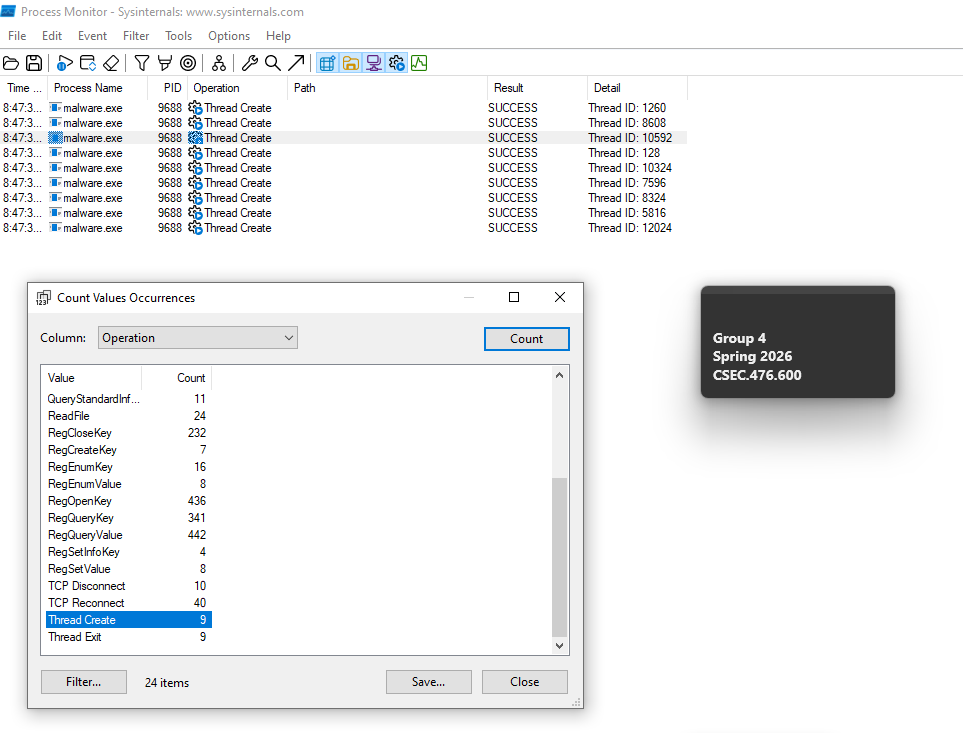

### FakeNet-NG, Process Explorer and TCPView

To observe the malware's runtime behavior, we executed *extracted\_malware.exe (group4.exe)* in a Windows 10 VM configured with a host-only adapter. Using ***FakeNet-NG*** to intercept and simulate network services, we monitored the process's outbound activity. Upon execution, the binary immediately attempted to establish external communication. As highlighted in the logs, the process (PID 6092) repeatedly requested a **TCP connection to the IP address 212.44.1.3 on port 8084**. This is important because this is the same IP address we obtained when we ran ***strings****.*

The same can be verified using Process Explorer and TCPView. The TCP/IP properties for malware.exe on Process Explorer show an active network connection attempt using the **TCP protocol**. The process has opened a local port (59938) and is attempting to connect to a remote IP address: **212.44.1.3 on port 8084**.

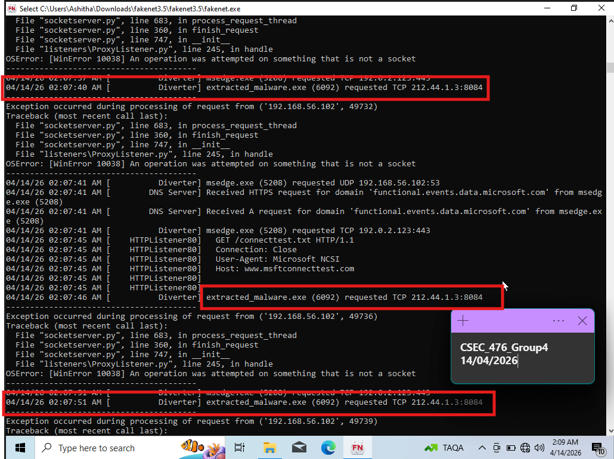

This tool effectively served as a local "honeypot" gateway by intercepting all outbound traffic and masquerading as the requested Command and Control (C2) server (212.44.1.3). Upon opening the resulting PCAP file in Wireshark, we observed that the malware initiated a persistent communication loop, successfully completing a TLS 1.2 handshake with the simulated server. This interaction is a critical finding, as it proves the malware is designed to operate via an encrypted tunnel to evade traditional packet inspection. By tricking the malware into "believing" it had reached its intended destination, we were able to confirm its beaconing behavior and intent to exfiltrate data or receive remote commands, all while maintaining a strictly contained and safe forensic environment. The successful completion of the Server Key Exchange and the subsequent Change Cipher Spec messages demonstrate that the malware is prepared to transition into an encrypted state, hiding the "Application Data" (Frame 4787) from basic packet-sniffing tools.

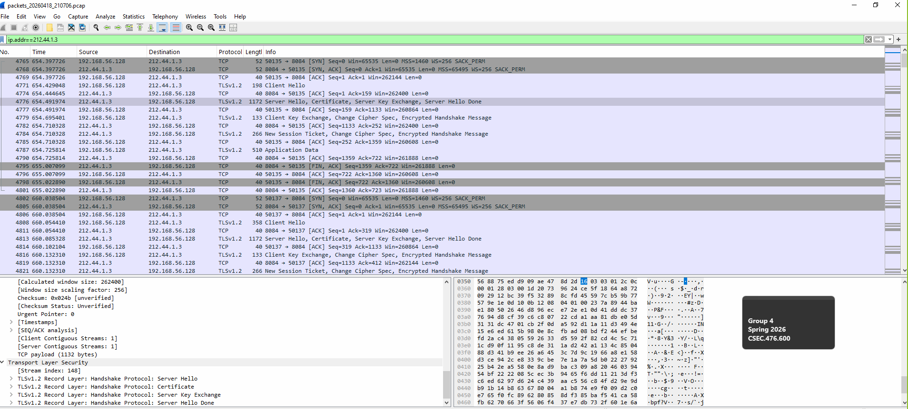

The use of a non-standard port like 8084 is a common indicator of Command & Control (C2) communication or data exfiltration, as it may bypass simple firewall configurations that only monitor standard ports like 80 or 443.

The connection state is currently listed as **SYN\_SENT.** In the context of the TCP three-way handshake, this means the malware has sent a synchronization packet to the remote server but has not yet received an acknowledgment (SYN-ACK). This persistent "SYN\_SENT" state often occurs in a lab environment where external internet access is disabled or redirected, confirming that the malware is actively "reaching out" to its infrastructure but is being successfully blocked or isolated by the sandbox's network configuration.

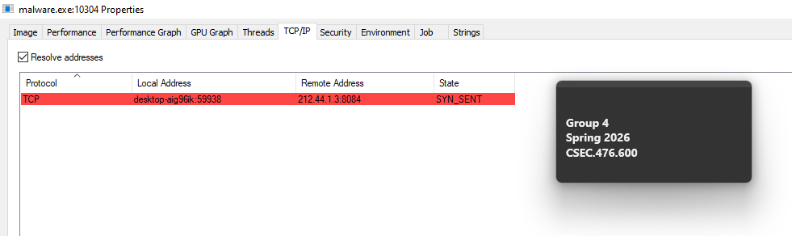

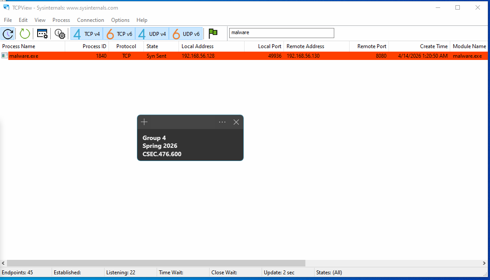

### Regshot

The most significant finding is the confirmation of malware execution through the UserAssist registry key, which stores recently executed programs in **ROT13 encoding**. The encoded value P:\\Hfref\\Nyvan\\Qbjaybnqf\\tebhc4 mvccrq\\tebhc4\\znyjner.rkr decodes to C:\\Users\\Alina\\Downloads\\group4 zipped\\group4\\malware.exe, providing forensic proof that the malware was executed from the Downloads directory during the analysis window. Supporting this, the **AppCompatFlags Compatibility Assistant key** recorded a persistent entry for the same path — C:\\Users\\Alina\\Downloads\\group4 zipped\\group4\\malware.exe — which is a Windows application compatibility artefact that survives file deletion and serves as lasting evidence of execution.

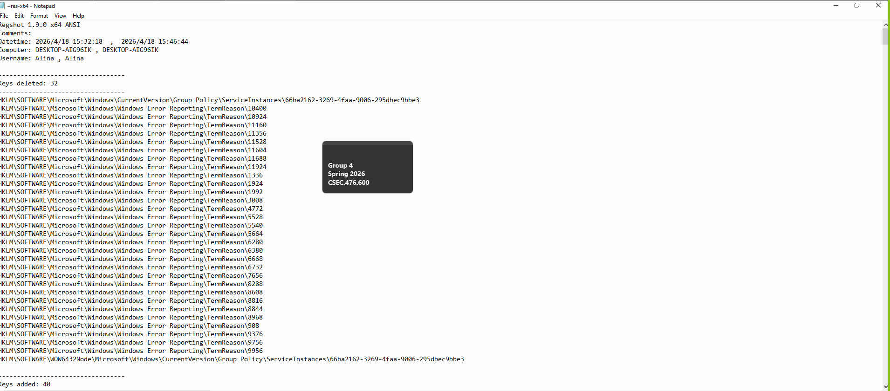

### Wireshark

While analyzing the wireshark logs, we identified **NBNS (NetBIOS Name Service)** queries originating from the infected host and directed toward the Command and Control (C2) IP. Typically, NBNS is a broadcast-heavy protocol used for local network discovery and name resolution.

Since there is no evidence of broadcast traffic or wide-subnet scanning, this suggests a deliberate attempt at **protocol obfuscation**. By routing initial connection handshakes through a legacy Windows protocol (UDP Port 137) rather than standard DNS or HTTP, the threat actor likely aims to evade modern DNS-filtering security controls and blend in with routine internal Windows traffic. This 'stealth-first' approach allows the beacon to establish a foothold without triggering the high-priority alerts usually associated with unauthorized outbound DNS requests.

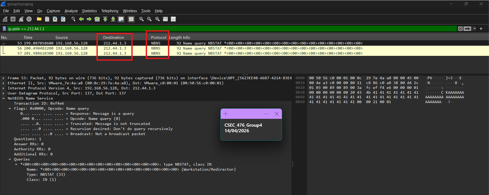

### Process Hacker

To observe the malware's behavior at the process level, we performed a Module Enumeration of *group4\_extracted.exe* during execution using ***Process Hacker***. This means the process is currently executing in memory, and the tool is displaying all the dynamic-link libraries (DLLs) that the program has loaded while running.

This runtime profile confirms the static analysis findings: the malware dynamically loads these libraries to facilitate the memory manipulation and network communication required for its command-and-control (C2) beaconing. The presence of these critical system modules within a process of such a small disk footprint (20.99 KB) is a strong indicator of a modular loader or stager. This confirms the attacker's strategy of using a lightweight "stub" to load larger malicious components directly into memory, bypassing standard disk-based detection.

The presence of **iertutil.dll** (Internet Explorer Runtime Utility) and mswsock.dll (Microsoft Windows Sockets) directly corroborates the WinINet-based C2 communication mechanism identified in static analysis. These libraries are loaded as dependencies of the WinInet stack, confirming that the process successfully initialised network communication capabilities at runtime. This is consistent with the LoadLibrary("wininet") call observed at breakpoint 0x1400050F1 in x64dbg.

The loading of **IPHLPAPI.DLL** (IP Helper API) is noteworthy, as this library exposes functions for enumerating network interfaces and adapter information. This is commonly leveraged by malware stagers for host fingerprinting prior to C2 check-in, allowing the implant to gather network configuration details about the victim machine.

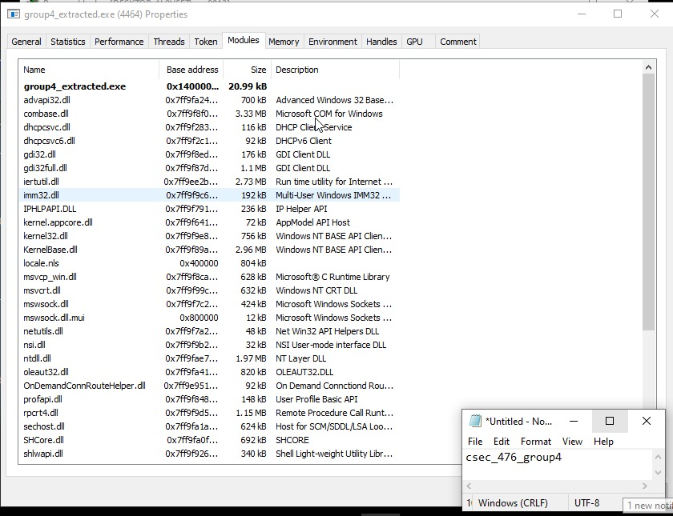

## Advanced Dynamic Analysis

To verify the malware's interaction with the Windows OS, we loaded the binary into the **x64dbg** debugger. The debugger is paused at address 0x1400050F1, which is the breakpoint set immediately after the LoadLibraryA("wininet") call in the code.

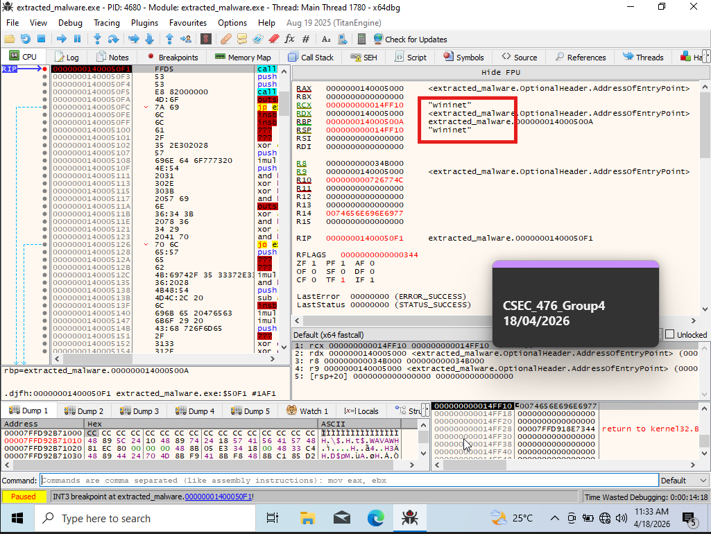

-   RCX = 0x14FF10 with the label "**wininet**": This is the argument that was just passed to **LoadLibraryA**, confirming the shellcode is loading the WinINet library for HTTP communications
-   RBP = 0x14000500A: This is the API resolver function pointer (the call rbp mechanism identified in static analysis)
-   RSI = also showing "wininet", consistent with the string pointer still in the register
-   R10 = 0x726774C: This is the ROR-13 hash for LoadLibraryA, exactly matching what was identified in the advanced static analysis.

This confirms that the dynamic behaviour matches the static analysis findings. The shellcode successfully resolved LoadLibraryA via PEB walking and ROR-13 hashing, and called it with "wininet" as the argument.

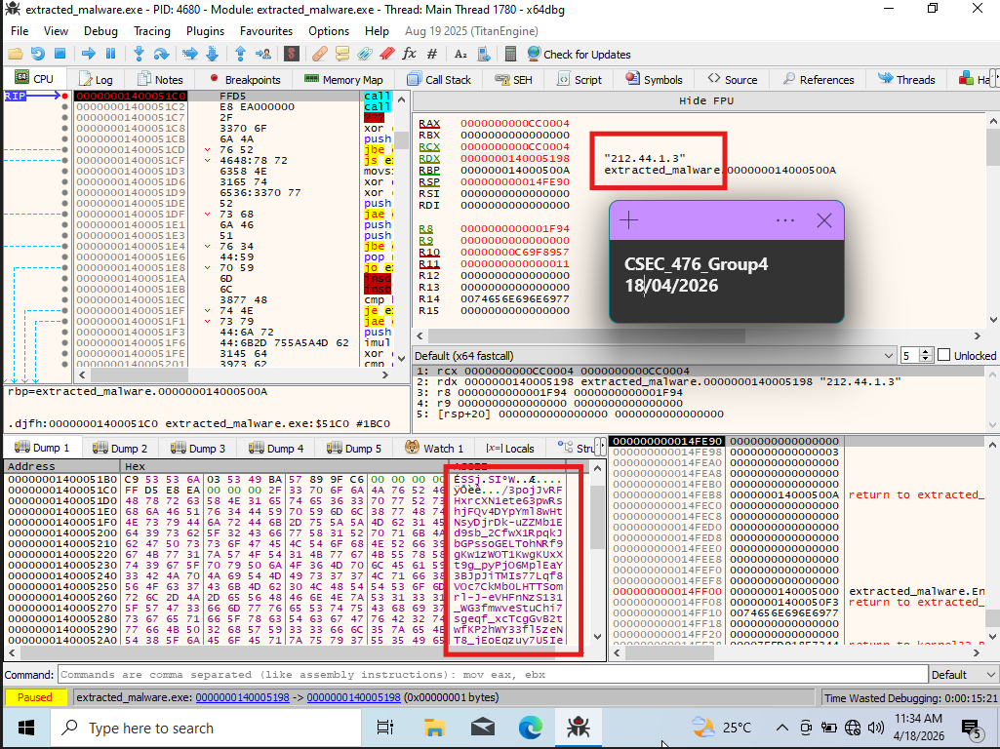

-   RCX = 0xCC0004: The WinINet internet handle returned by the previous InternetOpenA call, confirming the **HTTP** session was successfully initialized
-   RDX = 0x140005198 pointing to the string "**212.44.1.3**": This is the hardcoded C2 server IP address, confirming our observation on Fakenet's TCP connections.
-   **R8 = 0x1F94: This is port 8084** in decimal, the non-standard C2 port identified in our Wireshark and Fakenet logs.

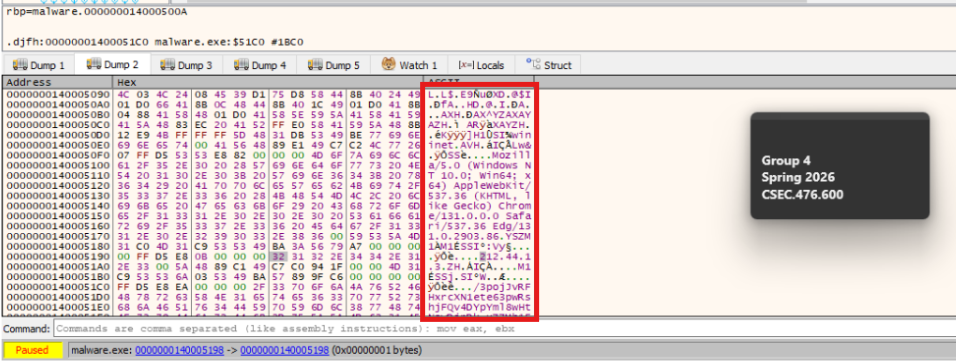In the dump window, the ASCII column clearly shows fragments of the embedded strings identified earlier including the long Base64-encoded C2 path (/3pojJVRF, HxrcXN1EtE63pwRs...), confirming the path string is loaded in memory adjacent to the shellcode. This dynamically confirms that the C2 indicators identified in static analysis, the IP 212.44.1.3, user-agent, and the encoded request path, are active at runtime.

# Conclusion

The malware sample represents a professionally constructed, multi-stage intrusion tool whose every component reflects deliberate design choices aimed at evading detection and maintaining persistent access. The decision to embed the executable within a PDF using FlateDecode compression, restrict static imports to a single API call, and redirect the entry point to a high-entropy non-standard section are not isolated obfuscation tricks. They form a cohesive strategy that successfully defeats every local signature-based scanner deployed against it, while achieving near-unanimous malicious verdicts only on platforms with broader threat intelligence coverage.

The weight of evidence across static analysis, dynamic monitoring, memory inspection, and YARA rule matching consistently identifies the sample as a Cobalt Strike-style beacon stager. Its use of PEB walking and ROR-13 API hashing to resolve functions at runtime, combined with a TLS 1.2-encrypted C2 channel over a non-standard port, demonstrates that the threat actor invested equal effort in concealing both the malware's on-disk footprint and its network presence. The successful completion of a Server Key Exchange and transition into encrypted Application Data, captured using FakeNet-NG, confirms that even if the beacon is detected on the network, its communications remain opaque to traditional packet inspection.

Ultimately, this sample illustrates a broader truth about modern malware: sophistication lies not in any single technique but in the deliberate combination of many. It was only through the systematic layering of static, dynamic, and advanced analysis that the complete attack chain could be reconstructed, from PDF dropper to in-memory shellcode to encrypted C2 beaconing, underscoring the necessity of multi-methodology analysis in any credible threat investigation.
